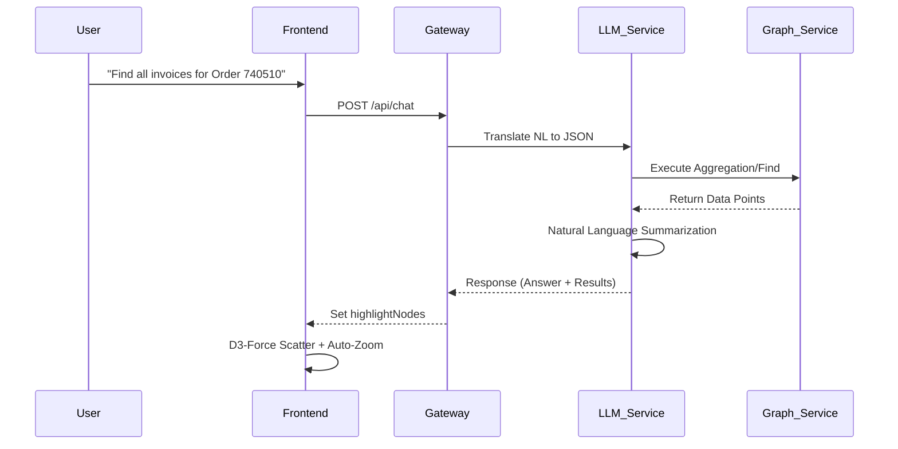

# 🧠 AI Development Chronicles: Context Graph System

This document provides a high-fidelity record of the iterative development, architectural decisions, and visual workflows of the **Context Graph System**. It traces the evolution from a raw CSV dataset to a premium, AI-driven visualization ecosystem.

---

## 🏗️ System Architecture Roadmap

The Context Graph is built on a quad-microservice architecture, ensuring strict decoupling between the intelligence layer, the data engine, and the visual frontend.

### Component Breakdown
| Component | Responsibility | Tech Stack |
| :--- | :--- | :--- |
| **API Gateway** | Request orchestration & proxying | Node.js / Express |
| **Graph Service** | Data persistence, BFS Traversal, Ingestion | Node.js / Mongoose / MongoDB |
| **LLM Service** | NL-to-Query Translation & Summarization | FastAPI / Groq / Llama-3 |
| **Frontend** | Force-directed visualization & Chat UI | React / React Flow / D3-Force |

---

## ⚡ The AI Query Lifecycle

The system utilizes a dual-pass AI pipeline to ensure data grounding and prevent hallucinations.

### Operational Flow (Mermaid)

---

## 📝 Session Chronicles

### 🔹 Session 1: Structural Ingestion
**User Intent:** "Parse my SAP O2C CSV data into a decoupled graph architecture."
- **Focus:** Decoupling ingestion from serving.
- **Hurdle:** Primary keys weren't unique across tables (e.g., Order ID vs Delivery ID).
- **Solution:** Implemented a composite `id + type` strategy in the `processedNodes` cache during ingestion.

---

### 🔹 Session 2: The Graph Data Engine
**User Intent:** "Build robust APIs for graph fetching and complex JSON aggregation."
- **Focus:** Supporting the LLM's structured query output.
- **Refinement:** Developed a custom BFS algorithm at the application layer to handle recursive lifecycles (Order → Delivery → Invoice).

---

### 🔹 Session 3: LLM Intelligence & Guardrails
**User Intent:** "Implement a secure NL-to-Query translation layer using Gemini."
- **Focus:** Data grounding and hallucination prevention.
- **Fix (Dual-Stage Validation):** 
  1. *NLP Verification:* Rejected junk queries locally before reaching the AI.
  2. *Schema Enforcement:* Validated LLM output against a strict set of MongoDB operations.

---

### 🔹 Session 4: React Flow & Visual Focusing
**User Intent:** "Create an interactive graph UI that highlights AI search results."
- **Focus:** User focusing in a large graph.
- **Fix:** Lifted state to `App.jsx` to dynamically reduce opacity of non-matching nodes, drawing immediate focus to search hits.

---

### 🔹 Session 5: The "Floating" Layout Revolution
**User Intent:** "The UI is breaking on large queries. Move away from static grids to a scattered, floating layout."
- **The Problem:** Result nodes were stacked at (0,0) or hidden.
- **The Fix:**
  1.  **Isolation:** Filtered the graph to *only* show results during an active search.
  2.  **Scattering:** Integrated `d3-force` to push result nodes apart organically.

---

### 🔹 Session 6: Mongoose Modernization
**User Intent:** "Fix the Mongoose callback errors and modernize the database engine."
- **Issue:** Mongoose 7/8 no longer accepts callbacks for `Model.find()`.
- **Solution:** Overhauled all repository routes to use native `async/await` and `.exec()` for promise-based execution.

---

### 🔹 Session 7: UX Refinement & Interactive Zoom
**User Intent:** "Nodes are still hard to see. Make the query results zoom in automatically."
- **The Fix:** Integrated `useReactFlow` to trigger smooth transitions. The graph now automatically "fits view" to search results, and users can manually re-zoom via the result badge.

---

### 🔹 Session 8: Permanent System Stability
**User Intent:** "I keep seeing 'Address already in use' errors. Fix this permanently."
- **Root Cause:** Orphaned background processes.
- **Permanent Fix:** Updated `start_all.bat` with an automated `netstat + taskkill` routine for ports 4000, 5000, 8000, and 5173.

---

## 🔥 Lessons from the Edge
- **Async Mongoose:** Always use `.exec()` for deterministic promise returns in Node.js.
- **Force Convergence:** nodes MUST be initialized with random coordinates before `d3-force` simulation starts to ensure scattering.
- **LLM Grounding:** Schema injection in the system prompt is the only way to achieve <1% hallucination in enterprise data tasks.

---
*End of Technical Log*
